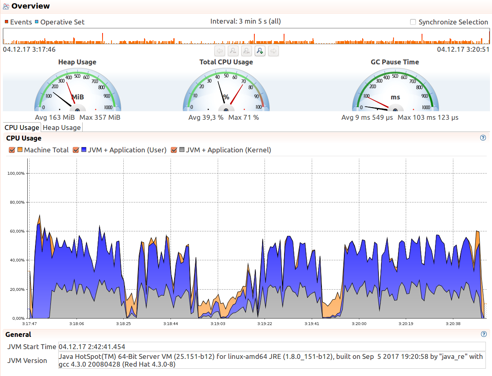
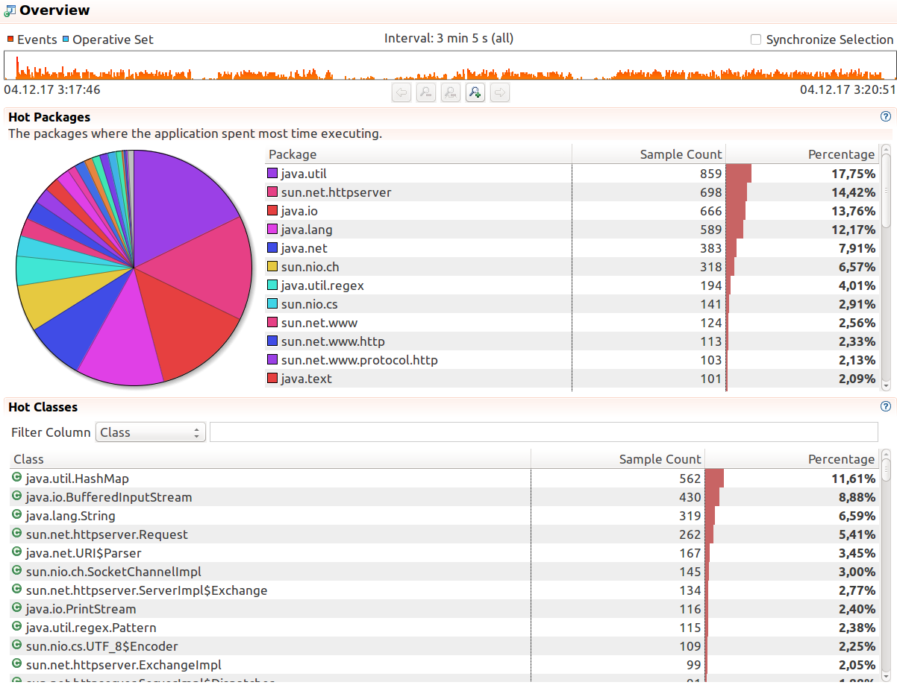

Тестирование проводилось с помошью утилиты wrk, были созданы скрипты на lua: 
PUT и GET с парамтерами replicas=2/2 и replicas=3/3 в двух вариантах. 
В первом варианте производится последовательные вставка, чтение, вставка и чтение с разными ключами без перезаписи,
во втором - выполняются те же действия, но ключи выбираются случайно из 100 возможных вариантов (имена скриптов начинаются с r).

Тестирование выполнялось для количества потоков 2, 4, 8 и количества соединений 4, 12, 150 соответсвенно. 

Ниже приведен результат тестирования до оптимизации:

```bash

Start service...
Starting node 0 on port 8080 and data at /tmp/highload-kv5752672090919951489
Starting node 1 on port 8081 and data at /tmp/highload-kv2671247951122483153
Starting node 2 on port 8082 and data at /tmp/highload-kv5661351712799161399

+wrk --latency -t2 -c4 -d2m -s status.lua http://localhost:8080
Running 2m test @ http://localhost:8080
  2 threads and 4 connections
  Thread Stats   Avg      Stdev     Max   +/- Stdev
    Latency    44.45ms    1.31ms  52.56ms   87.67%
    Req/Sec    45.00      6.65    60.00     90.45%
  Latency Distribution
     50%   43.98ms
     75%   44.04ms
     90%   47.88ms
     99%   48.06ms
  10794 requests in 2.00m, 0.92MB read
Requests/sec:     89.91
Transfer/sec:      7.82KB

+wrk --latency -t2 -c4 -d2m -s rputget33.lua http://localhost:8080
Running 2m test @ http://localhost:8080
  2 threads and 4 connections
  Thread Stats   Avg      Stdev     Max   +/- Stdev
    Latency    62.13ms  105.08ms   1.54s    96.57%
    Req/Sec    43.20      8.41    60.00     87.91%
  Latency Distribution
     50%   43.98ms
     75%   47.86ms
     90%   48.01ms
     99%  519.90ms
  10005 requests in 2.00m, 5.56MB read
  Non-2xx or 3xx responses: 186
Requests/sec:     83.31
Transfer/sec:     47.44KB

+wrk --latency -t2 -c4 -d2m -s rputget23.lua http://localhost:8080
Running 2m test @ http://localhost:8080
  2 threads and 4 connections
  Thread Stats   Avg      Stdev     Max   +/- Stdev
    Latency    45.21ms    3.79ms 171.99ms   99.38%
    Req/Sec    44.26      6.33    60.00     92.58%
  Latency Distribution
     50%   43.98ms
     75%   47.91ms
     90%   47.97ms
     99%   48.04ms
  10614 requests in 2.00m, 5.75MB read
  Non-2xx or 3xx responses: 198
Requests/sec:     88.44
Transfer/sec:     49.03KB

+wrk --latency -t2 -c4 -d2m -s rput33.lua http://localhost:8080
Running 2m test @ http://localhost:8080
  2 threads and 4 connections
  Thread Stats   Avg      Stdev     Max   +/- Stdev
    Latency    45.26ms    3.69ms  95.91ms   99.43%
    Req/Sec    44.20      6.92    60.00     88.28%
  Latency Distribution
     50%   43.98ms
     75%   47.91ms
     90%   47.97ms
     99%   48.04ms
  10601 requests in 2.00m, 0.95MB read
Requests/sec:     88.29
Transfer/sec:      8.11KB

+wrk --latency -t2 -c4 -d2m -s rput23.lua http://localhost:8080
Running 2m test @ http://localhost:8080
  2 threads and 4 connections
  Thread Stats   Avg      Stdev     Max   +/- Stdev
    Latency    45.11ms    2.81ms 111.96ms   76.05%
    Req/Sec    44.30      6.35    60.00     92.17%
  Latency Distribution
     50%   43.98ms
     75%   47.90ms
     90%   47.97ms
     99%   48.03ms
  10633 requests in 2.00m, 0.95MB read
Requests/sec:     88.59
Transfer/sec:      8.14KB

+wrk --latency -t2 -c4 -d2m -s rget33.lua http://localhost:8080
Running 2m test @ http://localhost:8080
  2 threads and 4 connections
  Thread Stats   Avg      Stdev     Max   +/- Stdev
    Latency    45.05ms    3.24ms  95.77ms   99.23%
    Req/Sec    44.38      6.24    60.00     92.87%
  Latency Distribution
     50%   43.98ms
     75%   44.11ms
     90%   47.97ms
     99%   48.09ms
  10643 requests in 2.00m, 0.90MB read
Requests/sec:     88.67
Transfer/sec:      7.71KB

+wrk --latency -t2 -c4 -d2m -s rget23.lua http://localhost:8080
Running 2m test @ http://localhost:8080
  2 threads and 4 connections
  Thread Stats   Avg      Stdev     Max   +/- Stdev
    Latency    45.12ms    2.54ms  95.95ms   72.01%
    Req/Sec    44.29      6.38    60.00     91.88%
  Latency Distribution
     50%   43.98ms
     75%   47.91ms
     90%   47.97ms
     99%   48.03ms
  10630 requests in 2.00m, 0.90MB read
Requests/sec:     88.56
Transfer/sec:      7.70KB

+wrk --latency -t2 -c4 -d2m -s putget33.lua http://localhost:8080
Running 2m test @ http://localhost:8080
  2 threads and 4 connections
  Thread Stats   Avg      Stdev     Max   +/- Stdev
    Latency    45.04ms    2.53ms  99.82ms   74.59%
    Req/Sec    44.39      6.35    60.00     92.16%
  Latency Distribution
     50%   43.98ms
     75%   47.78ms
     90%   47.97ms
     99%   48.06ms
  10651 requests in 2.00m, 4.93MB read
  Non-2xx or 3xx responses: 210
Requests/sec:     88.70
Transfer/sec:     42.06KB

+wrk --latency -t2 -c4 -d2m -s putget23.lua http://localhost:8080
Running 2m test @ http://localhost:8080
  2 threads and 4 connections
  Thread Stats   Avg      Stdev     Max   +/- Stdev
    Latency    44.91ms    2.61ms  95.95ms   77.79%
    Req/Sec    44.51      6.28    60.00     92.70%
  Latency Distribution
     50%   43.97ms
     75%   44.08ms
     90%   47.95ms
     99%   48.85ms
  10675 requests in 2.00m, 5.14MB read
  Non-2xx or 3xx responses: 110
Requests/sec:     88.93
Transfer/sec:     43.85KB

+wrk --latency -t2 -c4 -d2m -s put33.lua http://localhost:8080
Running 2m test @ http://localhost:8080
  2 threads and 4 connections
  Thread Stats   Avg      Stdev     Max   +/- Stdev
    Latency    45.26ms    5.49ms 215.83ms   98.46%
    Req/Sec    44.31      6.21    60.00     93.53%
  Latency Distribution
     50%   43.98ms
     75%   47.71ms
     90%   47.97ms
     99%   51.87ms
  10620 requests in 2.00m, 0.95MB read
Requests/sec:     88.45
Transfer/sec:      8.12KB

+wrk --latency -t2 -c4 -d2m -s put23.lua http://localhost:8080
Running 2m test @ http://localhost:8080
  2 threads and 4 connections
  Thread Stats   Avg      Stdev     Max   +/- Stdev
    Latency    44.81ms    2.83ms 143.96ms   80.08%
    Req/Sec    44.61      6.39    60.00     92.20%
  Latency Distribution
     50%   43.97ms
     75%   44.06ms
     90%   47.94ms
     99%   48.09ms
  10698 requests in 2.00m, 0.96MB read
Requests/sec:     89.13
Transfer/sec:      8.18KB

+wrk --latency -t2 -c4 -d2m -s get33.lua http://localhost:8080
Running 2m test @ http://localhost:8080
  2 threads and 4 connections
  Thread Stats   Avg      Stdev     Max   +/- Stdev
    Latency    44.99ms    3.54ms  96.05ms   98.97%
    Req/Sec    44.41      6.51    60.00     91.25%
  Latency Distribution
     50%   43.97ms
     75%   44.07ms
     90%   47.95ms
     99%   48.55ms
  10656 requests in 2.00m, 11.56MB read
  Non-2xx or 3xx responses: 9
Requests/sec:     88.73
Transfer/sec:     98.54KB

+wrk --latency -t2 -c4 -d2m -s get23.lua http://localhost:8080
Running 2m test @ http://localhost:8080
  2 threads and 4 connections
  Thread Stats   Avg      Stdev     Max   +/- Stdev
    Latency    44.78ms    2.52ms  95.94ms   80.73%
    Req/Sec    44.62      6.37    60.00     92.25%
  Latency Distribution
     50%   43.97ms
     75%   44.02ms
     90%   47.95ms
     99%   48.04ms
  10709 requests in 2.00m, 10.71MB read
  Non-2xx or 3xx responses: 1
Requests/sec:     89.20
Transfer/sec:     91.37KB

Stop service...
Stopping Daemon(s)
2 Daemons stopped

Start service...
Starting node 0 on port 8080 and data at /tmp/highload-kv8851413131586875837
Starting node 1 on port 8081 and data at /tmp/highload-kv5243737244892377831
Starting node 2 on port 8082 and data at /tmp/highload-kv3524706359233318361

+wrk --latency -t4 -c12 -d2m -s status.lua http://localhost:8080
Running 2m test @ http://localhost:8080
  4 threads and 12 connections
  Thread Stats   Avg      Stdev     Max   +/- Stdev
    Latency    44.43ms    1.28ms  56.81ms   88.46%
    Req/Sec    67.53      8.31    90.00     81.19%
  Latency Distribution
     50%   43.99ms
     75%   44.03ms
     90%   47.85ms
     99%   48.08ms
  32395 requests in 2.00m, 2.75MB read
Requests/sec:    269.83
Transfer/sec:     23.46KB

+wrk --latency -t4 -c12 -d2m -s rputget33.lua http://localhost:8080
Running 2m test @ http://localhost:8080
  4 threads and 12 connections
  Thread Stats   Avg      Stdev     Max   +/- Stdev
    Latency    47.49ms   14.19ms 323.85ms   96.48%
    Req/Sec    64.25     10.24    90.00     81.65%
  Latency Distribution
     50%   44.00ms
     75%   47.91ms
     90%   48.04ms
     99%  104.09ms
  30735 requests in 2.00m, 18.73MB read
  Non-2xx or 3xx responses: 360
Requests/sec:    256.07
Transfer/sec:    159.79KB

+wrk --latency -t4 -c12 -d2m -s rputget23.lua http://localhost:8080
Running 2m test @ http://localhost:8080
  4 threads and 12 connections
  Thread Stats   Avg      Stdev     Max   +/- Stdev
    Latency    47.86ms   19.58ms 464.27ms   96.71%
    Req/Sec    64.63     10.30    90.00     81.00%
  Latency Distribution
     50%   43.99ms
     75%   47.88ms
     90%   48.01ms
     99%  124.02ms
  30867 requests in 2.00m, 19.76MB read
  Non-2xx or 3xx responses: 432
Requests/sec:    257.01
Transfer/sec:    168.52KB

+wrk --latency -t4 -c12 -d2m -s rput33.lua http://localhost:8080
Running 2m test @ http://localhost:8080
  4 threads and 12 connections
  Thread Stats   Avg      Stdev     Max   +/- Stdev
    Latency    45.60ms    4.94ms  96.05ms   98.01%
    Req/Sec    65.77      8.00    90.00     83.87%
  Latency Distribution
     50%   43.99ms
     75%   47.88ms
     90%   47.99ms
     99%   87.72ms
  31559 requests in 2.00m, 2.83MB read
Requests/sec:    262.78
Transfer/sec:     24.13KB

+wrk --latency -t4 -c12 -d2m -s rput23.lua http://localhost:8080
Running 2m test @ http://localhost:8080
  4 threads and 12 connections
  Thread Stats   Avg      Stdev     Max   +/- Stdev
    Latency    45.27ms    3.96ms  96.05ms   98.89%
    Req/Sec    66.22      8.17    90.00     82.79%
  Latency Distribution
     50%   43.99ms
     75%   47.81ms
     90%   47.98ms
     99%   51.65ms
  31789 requests in 2.00m, 2.85MB read
Requests/sec:    264.71
Transfer/sec:     24.31KB

+wrk --latency -t4 -c12 -d2m -s rget33.lua http://localhost:8080
Running 2m test @ http://localhost:8080
  4 threads and 12 connections
  Thread Stats   Avg      Stdev     Max   +/- Stdev
    Latency    45.62ms    4.95ms  99.90ms   98.11%
    Req/Sec    65.74      8.10    90.00     83.88%
  Latency Distribution
     50%   43.99ms
     75%   47.88ms
     90%   47.99ms
     99%   87.74ms
  31556 requests in 2.00m, 2.68MB read
Requests/sec:    262.77
Transfer/sec:     22.85KB

+wrk --latency -t4 -c12 -d2m -s rget23.lua http://localhost:8080
Running 2m test @ http://localhost:8080
  4 threads and 12 connections
  Thread Stats   Avg      Stdev     Max   +/- Stdev
    Latency    45.29ms    3.91ms 104.27ms   98.88%
    Req/Sec    66.19      8.16    90.00     83.20%
  Latency Distribution
     50%   43.99ms
     75%   47.81ms
     90%   47.98ms
     99%   51.67ms
  31769 requests in 2.00m, 2.70MB read
Requests/sec:    264.52
Transfer/sec:     23.00KB

+wrk --latency -t4 -c12 -d2m -s putget33.lua http://localhost:8080
Running 2m test @ http://localhost:8080
  4 threads and 12 connections
  Thread Stats   Avg      Stdev     Max   +/- Stdev
    Latency    46.27ms   10.81ms 359.97ms   98.33%
    Req/Sec    65.39      8.80    90.00     83.19%
  Latency Distribution
     50%   43.99ms
     75%   47.90ms
     90%   48.00ms
     99%   87.93ms
  31337 requests in 2.00m, 18.44MB read
  Non-2xx or 3xx responses: 206
Requests/sec:    260.92
Transfer/sec:    157.23KB

+wrk --latency -t4 -c12 -d2m -s putget23.lua http://localhost:8080
Running 2m test @ http://localhost:8080
  4 threads and 12 connections
  Thread Stats   Avg      Stdev     Max   +/- Stdev
    Latency    46.06ms    7.77ms 259.90ms   98.05%
    Req/Sec    65.37      8.93    90.00     82.10%
  Latency Distribution
     50%   43.99ms
     75%   47.93ms
     90%   47.99ms
     99%   87.94ms
  31341 requests in 2.00m, 19.25MB read
  Non-2xx or 3xx responses: 228
Requests/sec:    260.96
Transfer/sec:    164.11KB

+wrk --latency -t4 -c12 -d2m -s put33.lua http://localhost:8080
Running 2m test @ http://localhost:8080
  4 threads and 12 connections
  Thread Stats   Avg      Stdev     Max   +/- Stdev
    Latency    47.15ms   17.50ms 471.91ms   98.01%
    Req/Sec    65.03      9.07    90.00     83.74%
  Latency Distribution
     50%   43.99ms
     75%   47.93ms
     90%   48.00ms
     99%   91.95ms
  31103 requests in 2.00m, 2.79MB read
Requests/sec:    258.98
Transfer/sec:     23.78KB

+wrk --latency -t4 -c12 -d2m -s put23.lua http://localhost:8080
Running 2m test @ http://localhost:8080
  4 threads and 12 connections
  Thread Stats   Avg      Stdev     Max   +/- Stdev
    Latency    45.80ms    6.48ms 188.00ms   98.61%
    Req/Sec    65.70      8.77    90.00     82.87%
  Latency Distribution
     50%   43.99ms
     75%   47.92ms
     90%   47.98ms
     99%   71.76ms
  31500 requests in 2.00m, 2.82MB read
Requests/sec:    262.29
Transfer/sec:     24.09KB

+wrk --latency -t4 -c12 -d2m -s get33.lua http://localhost:8080
Running 2m test @ http://localhost:8080
  4 threads and 12 connections
  Thread Stats   Avg      Stdev     Max   +/- Stdev
    Latency    45.86ms    5.80ms 135.84ms   97.45%
    Req/Sec    65.38      8.14    90.00     82.87%
  Latency Distribution
     50%   43.99ms
     75%   47.89ms
     90%   47.99ms
     99%   87.95ms
  31377 requests in 2.00m, 26.93MB read
  Non-2xx or 3xx responses: 194
Requests/sec:    261.29
Transfer/sec:    229.65KB

+wrk --latency -t4 -c12 -d2m -s get23.lua http://localhost:8080
Running 2m test @ http://localhost:8080
  4 threads and 12 connections
  Thread Stats   Avg      Stdev     Max   +/- Stdev
    Latency    45.47ms    4.81ms 120.04ms   98.45%
    Req/Sec    65.94      8.38    90.00     82.23%
  Latency Distribution
     50%   43.99ms
     75%   47.82ms
     90%   47.98ms
     99%   55.79ms
  31654 requests in 2.00m, 35.87MB read
  Non-2xx or 3xx responses: 55
Requests/sec:    263.59
Transfer/sec:    305.84KB

Stop service...
Stopping Daemon(s)
1 Daemon stopped

Start service...
Starting node 0 on port 8080 and data at /tmp/highload-kv2794230928202367098
Starting node 1 on port 8081 and data at /tmp/highload-kv940956780998144437
Starting node 2 on port 8082 and data at /tmp/highload-kv2098992869877800889

+wrk --latency -t8 -c150 -d2m -s status.lua http://localhost:8080
Running 2m test @ http://localhost:8080
  8 threads and 150 connections
  Thread Stats   Avg      Stdev     Max   +/- Stdev
    Latency    44.83ms    2.74ms 211.95ms   80.47%
    Req/Sec   402.15     43.98   545.00     83.52%
  Latency Distribution
     50%   44.01ms
     75%   44.34ms
     90%   47.97ms
     99%   48.41ms
  383234 requests in 2.00m, 32.54MB read
Requests/sec:   3192.26
Transfer/sec:    277.55KB

+wrk --latency -t8 -c150 -d2m -s rputget33.lua http://localhost:8080
Running 2m test @ http://localhost:8080
  8 threads and 150 connections
  Thread Stats   Avg      Stdev     Max   +/- Stdev
    Latency    82.48ms  119.27ms   1.51s    94.95%
    Req/Sec   295.31     86.11   454.00     78.95%
  Latency Distribution
     50%   52.00ms
     75%   64.04ms
     90%  102.53ms
     99%  802.28ms
  275747 requests in 2.00m, 134.69MB read
  Non-2xx or 3xx responses: 453
Requests/sec:   2296.06
Transfer/sec:      1.12MB

+wrk --latency -t8 -c150 -d2m -s rputget23.lua http://localhost:8080
Running 2m test @ http://localhost:8080
  8 threads and 150 connections
  Thread Stats   Avg      Stdev     Max   +/- Stdev
    Latency    66.26ms   88.08ms   1.33s    95.42%
    Req/Sec   343.00     84.24   510.00     85.50%
  Latency Distribution
     50%   47.92ms
     75%   51.91ms
     90%   72.11ms
     99%  548.03ms
  321709 requests in 2.00m, 192.18MB read
  Non-2xx or 3xx responses: 498
Requests/sec:   2678.72
Transfer/sec:      1.60MB

+wrk --latency -t8 -c150 -d2m -s rput33.lua http://localhost:8080
Running 2m test @ http://localhost:8080
  8 threads and 150 connections
  Thread Stats   Avg      Stdev     Max   +/- Stdev
    Latency    77.17ms  136.61ms   1.32s    95.59%
    Req/Sec   343.93     47.17   470.00     72.06%
  Latency Distribution
     50%   47.96ms
     75%   51.98ms
     90%   60.21ms
     99%  903.30ms
  328941 requests in 2.00m, 29.50MB read
Requests/sec:   2738.96
Transfer/sec:    251.51KB

+wrk --latency -t8 -c150 -d2m -s rput23.lua http://localhost:8080
Running 2m test @ http://localhost:8080
  8 threads and 150 connections
  Thread Stats   Avg      Stdev     Max   +/- Stdev
    Latency    51.46ms   54.57ms   1.13s    99.22%
    Req/Sec   378.46     34.96   490.00     77.18%
  Latency Distribution
     50%   47.61ms
     75%   48.01ms
     90%   51.96ms
     99%   91.99ms
  361654 requests in 2.00m, 32.43MB read
Requests/sec:   3011.47
Transfer/sec:    276.54KB

+wrk --latency -t8 -c150 -d2m -s rget33.lua http://localhost:8080
Running 2m test @ http://localhost:8080
  8 threads and 150 connections
  Thread Stats   Avg      Stdev     Max   +/- Stdev
    Latency    78.18ms  136.65ms   1.15s    95.55%
    Req/Sec   335.62     52.95   470.00     71.19%
  Latency Distribution
     50%   48.01ms
     75%   52.47ms
     90%   63.99ms
     99%  903.39ms
  320614 requests in 2.00m, 27.22MB read
Requests/sec:   2669.60
Transfer/sec:    232.11KB

+wrk --latency -t8 -c150 -d2m -s rget23.lua http://localhost:8080
Running 2m test @ http://localhost:8080
  8 threads and 150 connections
  Thread Stats   Avg      Stdev     Max   +/- Stdev
    Latency    48.64ms   34.31ms   1.26s    98.81%
    Req/Sec   382.41     31.19   505.00     77.03%
  Latency Distribution
     50%   44.25ms
     75%   47.99ms
     90%   51.88ms
     99%   87.89ms
  364629 requests in 2.00m, 30.96MB read
Requests/sec:   3036.17
Transfer/sec:    263.98KB

+wrk --latency -t8 -c150 -d2m -s putget33.lua http://localhost:8080
Running 2m test @ http://localhost:8080
  8 threads and 150 connections
  Thread Stats   Avg      Stdev     Max   +/- Stdev
    Latency    70.74ms   96.83ms   1.16s    96.78%
    Req/Sec   310.99     71.57   484.00     79.42%
  Latency Distribution
     50%   51.96ms
     75%   60.02ms
     90%   76.01ms
     99%  686.85ms
  296676 requests in 2.00m, 192.17MB read
  Non-2xx or 3xx responses: 4143
Requests/sec:   2470.24
Transfer/sec:      1.60MB

+wrk --latency -t8 -c150 -d2m -s putget23.lua http://localhost:8080
Running 2m test @ http://localhost:8080
  8 threads and 150 connections
  Thread Stats   Avg      Stdev     Max   +/- Stdev
    Latency    77.41ms  117.56ms   1.17s    95.80%
    Req/Sec   311.22     72.94   450.00     81.41%
  Latency Distribution
     50%   51.90ms
     75%   59.92ms
     90%   87.37ms
     99%  823.43ms
  295014 requests in 2.00m, 138.41MB read
  Non-2xx or 3xx responses: 4183
Requests/sec:   2456.48
Transfer/sec:      1.15MB

+wrk --latency -t8 -c150 -d2m -s put33.lua http://localhost:8080
Running 2m test @ http://localhost:8080
  8 threads and 150 connections
  Thread Stats   Avg      Stdev     Max   +/- Stdev
    Latency    90.33ms  128.74ms   1.46s    93.34%
    Req/Sec   284.94     89.57   450.00     77.65%
  Latency Distribution
     50%   52.16ms
     75%   67.89ms
     90%  139.00ms
     99%  846.37ms
  262989 requests in 2.00m, 23.58MB read
  Socket errors: connect 0, read 0, write 0, timeout 2
Requests/sec:   2190.72
Transfer/sec:    201.16KB

+wrk --latency -t8 -c150 -d2m -s put23.lua http://localhost:8080
Running 2m test @ http://localhost:8080
  8 threads and 150 connections
  Thread Stats   Avg      Stdev     Max   +/- Stdev
    Latency    66.26ms   72.95ms   1.24s    93.92%
    Req/Sec   334.64     89.64   480.00     86.66%
  Latency Distribution
     50%   47.97ms
     75%   52.31ms
     90%   80.25ms
     99%  387.99ms
  312732 requests in 2.00m, 28.05MB read
Requests/sec:   2603.98
Transfer/sec:    239.13KB

+wrk --latency -t8 -c150 -d2m -s get33.lua http://localhost:8080
Running 2m test @ http://localhost:8080
  8 threads and 150 connections
  Thread Stats   Avg      Stdev     Max   +/- Stdev
    Latency    94.30ms  127.04ms   1.16s    95.26%
    Req/Sec   249.03     74.72   460.00     73.15%
  Latency Distribution
     50%   63.94ms
     75%   83.89ms
     90%  119.61ms
     99%  866.06ms
  235123 requests in 2.00m, 222.67MB read
Requests/sec:   1958.80
Transfer/sec:      1.86MB

+wrk --latency -t8 -c150 -d2m -s get23.lua http://localhost:8080
Running 2m test @ http://localhost:8080
  8 threads and 150 connections
  Thread Stats   Avg      Stdev     Max   +/- Stdev
    Latency    70.60ms   63.05ms   1.23s    91.85%
    Req/Sec   298.29    102.74   464.00     78.60%
  Latency Distribution
     50%   51.74ms
     75%   63.99ms
     90%  114.49ms
     99%  338.76ms
  279832 requests in 2.00m, 304.77MB read
Requests/sec:   2330.13
Transfer/sec:      2.54MB

Stop service...
Stopping Daemon(s)
1 Daemon stopped
 ```
 
 Для профилирования использовалась программа JMC. Было выполнено профилирование 
 в течение трех минут во время тестирования с помощью wrk. Использовался скрипт rputget33, 8 потоков, 150 подключений. 
 
 
 
 
 
 
 Для улучшения работы было выполнены следующие действия:
 + Упрощение разбора ключей из запроса (выполнялось дважды для каждого запроса)
 + Рализация параллельного опроса реплик с помошью FutureTask
 
 
 Результаты тестирования получены следующие:
 
 ```bash
 
Start service...
Starting node 0 on port 8080 and data at /tmp/highload-kv4365157500946226038
Starting node 1 on port 8081 and data at /tmp/highload-kv6784692232010391686
Starting node 2 on port 8082 and data at /tmp/highload-kv6549275738566594051

+wrk --latency -t2 -c4 -d2m -s status.lua http://localhost:8080
Running 2m test @ http://localhost:8080
  2 threads and 4 connections
  Thread Stats   Avg      Stdev     Max   +/- Stdev
    Latency    44.24ms    1.12ms  59.21ms   92.80%
    Req/Sec    45.18      6.42    60.00     91.88%
  Latency Distribution
     50%   43.97ms
     75%   44.01ms
     90%   44.06ms
     99%   48.02ms
  10843 requests in 2.00m, 0.92MB read
Requests/sec:     90.32
Transfer/sec:      7.85KB

+wrk --latency -t2 -c4 -d2m -s rputget33.lua http://localhost:8080
Running 2m test @ http://localhost:8080
  2 threads and 4 connections
  Thread Stats   Avg      Stdev     Max   +/- Stdev
    Latency    44.81ms    2.61ms 119.95ms   80.25%
    Req/Sec    44.60      6.20    60.00     93.54%
  Latency Distribution
     50%   43.95ms
     75%   44.05ms
     90%   47.92ms
     99%   48.12ms
  10703 requests in 2.00m, 6.55MB read
  Non-2xx or 3xx responses: 196
Requests/sec:     89.13
Transfer/sec:     55.82KB

+wrk --latency -t2 -c4 -d2m -s rputget23.lua http://localhost:8080
Running 2m test @ http://localhost:8080
  2 threads and 4 connections
  Thread Stats   Avg      Stdev     Max   +/- Stdev
    Latency    44.81ms    3.17ms 140.03ms   95.54%
    Req/Sec    44.60      6.41    60.00     92.46%
  Latency Distribution
     50%   43.94ms
     75%   44.04ms
     90%   47.92ms
     99%   48.11ms
  10702 requests in 2.00m, 5.13MB read
  Non-2xx or 3xx responses: 186
Requests/sec:     89.13
Transfer/sec:     43.77KB

+wrk --latency -t2 -c4 -d2m -s rput33.lua http://localhost:8080
Running 2m test @ http://localhost:8080
  2 threads and 4 connections
  Thread Stats   Avg      Stdev     Max   +/- Stdev
    Latency    44.73ms    1.85ms  55.86ms   79.88%
    Req/Sec    44.65      6.09    60.00     93.88%
  Latency Distribution
     50%   43.94ms
     75%   44.05ms
     90%   47.92ms
     99%   48.10ms
  10718 requests in 2.00m, 0.96MB read
Requests/sec:     89.26
Transfer/sec:      8.20KB

+wrk --latency -t2 -c4 -d2m -s rput23.lua http://localhost:8080
Running 2m test @ http://localhost:8080
  2 threads and 4 connections
  Thread Stats   Avg      Stdev     Max   +/- Stdev
    Latency    44.69ms    1.82ms  54.67ms   80.83%
    Req/Sec    44.70      6.23    60.00     93.08%
  Latency Distribution
     50%   43.94ms
     75%   44.04ms
     90%   47.91ms
     99%   48.08ms
  10729 requests in 2.00m, 0.96MB read
Requests/sec:     89.33
Transfer/sec:      8.20KB

+wrk --latency -t2 -c4 -d2m -s rget33.lua http://localhost:8080
Running 2m test @ http://localhost:8080
  2 threads and 4 connections
  Thread Stats   Avg      Stdev     Max   +/- Stdev
    Latency    44.75ms    2.65ms  95.87ms   81.12%
    Req/Sec    44.64      6.21    60.00     93.20%
  Latency Distribution
     50%   43.94ms
     75%   44.04ms
     90%   47.92ms
     99%   48.10ms
  10707 requests in 2.00m, 0.91MB read
Requests/sec:     89.22
Transfer/sec:      7.76KB

+wrk --latency -t2 -c4 -d2m -s rget23.lua http://localhost:8080
Running 2m test @ http://localhost:8080
  2 threads and 4 connections
  Thread Stats   Avg      Stdev     Max   +/- Stdev
    Latency    44.75ms    2.68ms  95.84ms   81.34%
    Req/Sec    44.64      6.23    60.00     93.08%
  Latency Distribution
     50%   43.94ms
     75%   44.04ms
     90%   47.92ms
     99%   48.09ms
  10716 requests in 2.00m, 0.91MB read
Requests/sec:     89.23
Transfer/sec:      7.76KB

+wrk --latency -t2 -c4 -d2m -s putget33.lua http://localhost:8080
Running 2m test @ http://localhost:8080
  2 threads and 4 connections
  Thread Stats   Avg      Stdev     Max   +/- Stdev
    Latency    44.72ms    2.33ms  99.89ms   81.22%
    Req/Sec    44.66      6.07    60.00     94.08%
  Latency Distribution
     50%   43.94ms
     75%   44.02ms
     90%   47.92ms
     99%   48.09ms
  10720 requests in 2.00m, 6.43MB read
  Non-2xx or 3xx responses: 88
Requests/sec:     89.28
Transfer/sec:     54.85KB

+wrk --latency -t2 -c4 -d2m -s putget23.lua http://localhost:8080
Running 2m test @ http://localhost:8080
  2 threads and 4 connections
  Thread Stats   Avg      Stdev     Max   +/- Stdev
    Latency    44.76ms    2.42ms  95.89ms   80.59%
    Req/Sec    44.62      6.28    60.00     92.75%
  Latency Distribution
     50%   43.94ms
     75%   44.03ms
     90%   47.92ms
     99%   48.10ms
  10710 requests in 2.00m, 6.50MB read
  Non-2xx or 3xx responses: 14
Requests/sec:     89.19
Transfer/sec:     55.45KB

+wrk --latency -t2 -c4 -d2m -s put33.lua http://localhost:8080
Running 2m test @ http://localhost:8080
  2 threads and 4 connections
  Thread Stats   Avg      Stdev     Max   +/- Stdev
    Latency    44.73ms    2.25ms 103.88ms   80.69%
    Req/Sec    44.64      6.16    60.00     93.67%
  Latency Distribution
     50%   43.94ms
     75%   44.03ms
     90%   47.91ms
     99%   48.09ms
  10714 requests in 2.00m, 0.96MB read
Requests/sec:     89.24
Transfer/sec:      8.19KB

+wrk --latency -t2 -c4 -d2m -s put23.lua http://localhost:8080
Running 2m test @ http://localhost:8080
  2 threads and 4 connections
  Thread Stats   Avg      Stdev     Max   +/- Stdev
    Latency    44.73ms    2.74ms 131.97ms   81.64%
    Req/Sec    44.65      6.26    60.00     93.12%
  Latency Distribution
     50%   43.94ms
     75%   44.02ms
     90%   47.91ms
     99%   48.10ms
  10718 requests in 2.00m, 0.96MB read
Requests/sec:     89.27
Transfer/sec:      8.20KB

+wrk --latency -t2 -c4 -d2m -s get33.lua http://localhost:8080
Running 2m test @ http://localhost:8080
  2 threads and 4 connections
  Thread Stats   Avg      Stdev     Max   +/- Stdev
    Latency    44.75ms    2.81ms  95.91ms   81.42%
    Req/Sec    44.63      6.31    60.00     92.50%
  Latency Distribution
     50%   43.93ms
     75%   44.02ms
     90%   47.91ms
     99%   48.08ms
  10713 requests in 2.00m, 12.77MB read
Requests/sec:     89.21
Transfer/sec:    108.90KB

+wrk --latency -t2 -c4 -d2m -s get23.lua http://localhost:8080
Running 2m test @ http://localhost:8080
  2 threads and 4 connections
  Thread Stats   Avg      Stdev     Max   +/- Stdev
    Latency    44.75ms    2.57ms  95.85ms   80.93%
    Req/Sec    44.64      6.29    60.00     92.66%
  Latency Distribution
     50%   43.93ms
     75%   44.02ms
     90%   47.91ms
     99%   48.07ms
  10711 requests in 2.00m, 11.26MB read
  Non-2xx or 3xx responses: 1
Requests/sec:     89.19
Transfer/sec:     95.98KB

Stop service...
Stopping Daemon(s)
1 Daemon stopped

Start service...
Starting node 0 on port 8080 and data at /tmp/highload-kv3445332878700427506
Starting node 1 on port 8081 and data at /tmp/highload-kv2419704736934675682
Starting node 2 on port 8082 and data at /tmp/highload-kv7394801604302616939

+wrk --latency -t4 -c12 -d2m -s status.lua http://localhost:8080
Running 2m test @ http://localhost:8080
  4 threads and 12 connections
  Thread Stats   Avg      Stdev     Max   +/- Stdev
    Latency    44.25ms    1.11ms  52.18ms   92.31%
    Req/Sec    67.73      8.32    90.00     80.69%
  Latency Distribution
     50%   43.96ms
     75%   44.01ms
     90%   44.08ms
     99%   48.02ms
  32510 requests in 2.00m, 2.76MB read
Requests/sec:    270.83
Transfer/sec:     23.55KB

+wrk --latency -t4 -c12 -d2m -s rputget33.lua http://localhost:8080
Running 2m test @ http://localhost:8080
  4 threads and 12 connections
  Thread Stats   Avg      Stdev     Max   +/- Stdev
    Latency    45.74ms    4.92ms 144.03ms   96.15%
    Req/Sec    65.57      8.05    90.00     85.65%
  Latency Distribution
     50%   43.99ms
     75%   47.86ms
     90%   48.00ms
     99%   68.01ms
  31452 requests in 2.00m, 18.29MB read
  Non-2xx or 3xx responses: 370
Requests/sec:    262.05
Transfer/sec:    156.01KB

+wrk --latency -t4 -c12 -d2m -s rputget23.lua http://localhost:8080
Running 2m test @ http://localhost:8080
  4 threads and 12 connections
  Thread Stats   Avg      Stdev     Max   +/- Stdev
    Latency    45.76ms    6.36ms 203.99ms   98.10%
    Req/Sec    65.69      8.33    90.00     84.86%
  Latency Distribution
     50%   43.98ms
     75%   47.84ms
     90%   48.00ms
     99%   71.81ms
  31500 requests in 2.00m, 16.26MB read
  Non-2xx or 3xx responses: 422
Requests/sec:    262.43
Transfer/sec:    138.70KB

+wrk --latency -t4 -c12 -d2m -s rput33.lua http://localhost:8080
Running 2m test @ http://localhost:8080
  4 threads and 12 connections
  Thread Stats   Avg      Stdev     Max   +/- Stdev
    Latency    45.10ms    2.08ms  60.19ms   71.58%
    Req/Sec    66.47      7.27    90.00     87.24%
  Latency Distribution
     50%   43.98ms
     75%   47.83ms
     90%   47.98ms
     99%   51.68ms
  31884 requests in 2.00m, 2.86MB read
Requests/sec:    265.63
Transfer/sec:     24.39KB

+wrk --latency -t4 -c12 -d2m -s rput23.lua http://localhost:8080
Running 2m test @ http://localhost:8080
  4 threads and 12 connections
  Thread Stats   Avg      Stdev     Max   +/- Stdev
    Latency    45.04ms    2.04ms  55.79ms   72.98%
    Req/Sec    66.57      7.26    90.00     87.01%
  Latency Distribution
     50%   43.98ms
     75%   47.79ms
     90%   47.98ms
     99%   48.20ms
  31931 requests in 2.00m, 2.86MB read
Requests/sec:    266.01
Transfer/sec:     24.43KB

+wrk --latency -t4 -c12 -d2m -s rget33.lua http://localhost:8080
Running 2m test @ http://localhost:8080
  4 threads and 12 connections
  Thread Stats   Avg      Stdev     Max   +/- Stdev
    Latency    45.43ms    4.36ms 107.94ms   98.18%
    Req/Sec    66.00      7.71    90.00     85.28%
  Latency Distribution
     50%   43.98ms
     75%   47.83ms
     90%   47.99ms
     99%   51.95ms
  31660 requests in 2.00m, 2.69MB read
Requests/sec:    263.74
Transfer/sec:     22.93KB

+wrk --latency -t4 -c12 -d2m -s rget23.lua http://localhost:8080
Running 2m test @ http://localhost:8080
  4 threads and 12 connections
  Thread Stats   Avg      Stdev     Max   +/- Stdev
    Latency    45.36ms    4.33ms  99.82ms   98.31%
    Req/Sec    66.10      7.48    90.00     85.95%
  Latency Distribution
     50%   43.97ms
     75%   47.80ms
     90%   47.98ms
     99%   51.91ms
  31707 requests in 2.00m, 2.69MB read
Requests/sec:    264.14
Transfer/sec:     22.97KB

+wrk --latency -t4 -c12 -d2m -s putget33.lua http://localhost:8080
Running 2m test @ http://localhost:8080
  4 threads and 12 connections
  Thread Stats   Avg      Stdev     Max   +/- Stdev
    Latency    45.66ms    5.50ms 207.96ms   96.93%
    Req/Sec    65.74      8.04    90.00     85.93%
  Latency Distribution
     50%   43.98ms
     75%   47.85ms
     90%   48.00ms
     99%   68.09ms
  31532 requests in 2.00m, 16.58MB read
  Non-2xx or 3xx responses: 70
Requests/sec:    262.71
Transfer/sec:    141.49KB

+wrk --latency -t4 -c12 -d2m -s putget23.lua http://localhost:8080
Running 2m test @ http://localhost:8080
  4 threads and 12 connections
  Thread Stats   Avg      Stdev     Max   +/- Stdev
    Latency    45.97ms    6.80ms 155.82ms   97.64%
    Req/Sec    65.41      8.78    90.00     84.31%
  Latency Distribution
     50%   43.98ms
     75%   47.85ms
     90%   48.00ms
     99%   84.07ms
  31368 requests in 2.00m, 20.41MB read
  Non-2xx or 3xx responses: 100
Requests/sec:    261.32
Transfer/sec:    174.11KB

+wrk --latency -t4 -c12 -d2m -s put33.lua http://localhost:8080
Running 2m test @ http://localhost:8080
  4 threads and 12 connections
  Thread Stats   Avg      Stdev     Max   +/- Stdev
    Latency    45.89ms    6.40ms 187.86ms   97.89%
    Req/Sec    65.50      8.56    90.00     84.84%
  Latency Distribution
     50%   43.99ms
     75%   47.87ms
     90%   48.01ms
     99%   71.95ms
  31413 requests in 2.00m, 2.82MB read
Requests/sec:    261.70
Transfer/sec:     24.03KB

+wrk --latency -t4 -c12 -d2m -s put23.lua http://localhost:8080
Running 2m test @ http://localhost:8080
  4 threads and 12 connections
  Thread Stats   Avg      Stdev     Max   +/- Stdev
    Latency    45.99ms    7.55ms 203.98ms   97.85%
    Req/Sec    65.51      8.96    90.00     83.97%
  Latency Distribution
     50%   43.98ms
     75%   47.85ms
     90%   48.00ms
     99%   76.02ms
  31406 requests in 2.00m, 2.82MB read
Requests/sec:    261.63
Transfer/sec:     24.03KB

+wrk --latency -t4 -c12 -d2m -s get33.lua http://localhost:8080
Running 2m test @ http://localhost:8080
  4 threads and 12 connections
  Thread Stats   Avg      Stdev     Max   +/- Stdev
    Latency    45.44ms    4.65ms  96.06ms   98.04%
    Req/Sec    65.98      7.44    90.00     86.43%
  Latency Distribution
     50%   43.97ms
     75%   47.81ms
     90%   47.98ms
     99%   51.98ms
  31648 requests in 2.00m, 31.97MB read
  Non-2xx or 3xx responses: 189
Requests/sec:    263.60
Transfer/sec:    272.68KB

+wrk --latency -t4 -c12 -d2m -s get23.lua http://localhost:8080
Running 2m test @ http://localhost:8080
  4 threads and 12 connections
  Thread Stats   Avg      Stdev     Max   +/- Stdev
    Latency    45.42ms    4.72ms 100.48ms   98.06%
    Req/Sec    66.01      7.54    90.00     85.57%
  Latency Distribution
     50%   43.97ms
     75%   47.80ms
     90%   47.98ms
     99%   52.11ms
  31664 requests in 2.00m, 30.16MB read
  Non-2xx or 3xx responses: 213
Requests/sec:    263.78
Transfer/sec:    257.32KB

Stop service...
Stopping Daemon(s)
1 Daemon stopped

Start service...
Starting node 0 on port 8080 and data at /tmp/highload-kv7161544388037147453
Starting node 1 on port 8081 and data at /tmp/highload-kv7042311861278613786
Starting node 2 on port 8082 and data at /tmp/highload-kv8100660454134162876

+wrk --latency -t8 -c150 -d2m -s status.lua http://localhost:8080
Running 2m test @ http://localhost:8080
  8 threads and 150 connections
  Thread Stats   Avg      Stdev     Max   +/- Stdev
    Latency    44.74ms    2.79ms 215.09ms   82.21%
    Req/Sec   403.39     31.17   540.00     73.30%
  Latency Distribution
     50%   43.99ms
     75%   44.25ms
     90%   47.95ms
     99%   48.40ms
  384194 requests in 2.00m, 32.62MB read
Requests/sec:   3199.30
Transfer/sec:    278.16KB

+wrk --latency -t8 -c150 -d2m -s rputget33.lua http://localhost:8080
Running 2m test @ http://localhost:8080
  8 threads and 150 connections
  Thread Stats   Avg      Stdev     Max   +/- Stdev
    Latency    54.87ms   27.48ms 328.05ms   94.74%
    Req/Sec   348.23     72.36   460.00     88.94%
  Latency Distribution
     50%   47.98ms
     75%   51.99ms
     90%   60.04ms
     99%  208.07ms
  329150 requests in 2.00m, 156.55MB read
  Non-2xx or 3xx responses: 329
Requests/sec:   2741.35
Transfer/sec:      1.30MB

+wrk --latency -t8 -c150 -d2m -s rputget23.lua http://localhost:8080
Running 2m test @ http://localhost:8080
  8 threads and 150 connections
  Thread Stats   Avg      Stdev     Max   +/- Stdev
    Latency    55.18ms   28.75ms 384.10ms   94.49%
    Req/Sec   349.49     71.55   515.00     89.16%
  Latency Distribution
     50%   47.97ms
     75%   51.99ms
     90%   60.10ms
     99%  215.79ms
  329755 requests in 2.00m, 188.13MB read
  Non-2xx or 3xx responses: 589
Requests/sec:   2746.26
Transfer/sec:      1.57MB

+wrk --latency -t8 -c150 -d2m -s rput33.lua http://localhost:8080
Running 2m test @ http://localhost:8080
  8 threads and 150 connections
  Thread Stats   Avg      Stdev     Max   +/- Stdev
    Latency    46.76ms    5.58ms   1.06s    97.57%
    Req/Sec   386.41     21.24   500.00     69.08%
  Latency Distribution
     50%   47.82ms
     75%   48.00ms
     90%   51.90ms
     99%   55.99ms
  369507 requests in 2.00m, 33.14MB read
Requests/sec:   3077.93
Transfer/sec:    282.65KB

+wrk --latency -t8 -c150 -d2m -s rput23.lua http://localhost:8080
Running 2m test @ http://localhost:8080
  8 threads and 150 connections
  Thread Stats   Avg      Stdev     Max   +/- Stdev
    Latency    46.58ms    3.12ms  80.02ms   87.26%
    Req/Sec   387.50     21.92   484.00     70.39%
  Latency Distribution
     50%   47.72ms
     75%   47.99ms
     90%   51.87ms
     99%   55.97ms
  370536 requests in 2.00m, 33.23MB read
Requests/sec:   3086.30
Transfer/sec:    283.41KB

+wrk --latency -t8 -c150 -d2m -s rget33.lua http://localhost:8080
Running 2m test @ http://localhost:8080
  8 threads and 150 connections
  Thread Stats   Avg      Stdev     Max   +/- Stdev
    Latency    48.87ms    7.54ms   1.01s    93.18%
    Req/Sec   369.22     30.44   480.00     72.22%
  Latency Distribution
     50%   47.94ms
     75%   51.91ms
     90%   55.97ms
     99%   68.06ms
  353042 requests in 2.00m, 29.97MB read
Requests/sec:   2940.88
Transfer/sec:    255.68KB

+wrk --latency -t8 -c150 -d2m -s rget23.lua http://localhost:8080
Running 2m test @ http://localhost:8080
  8 threads and 150 connections
  Thread Stats   Avg      Stdev     Max   +/- Stdev
    Latency    48.78ms    7.43ms   1.02s    93.47%
    Req/Sec   369.69     30.60   460.00     78.18%
  Latency Distribution
     50%   47.94ms
     75%   51.90ms
     90%   55.96ms
     99%   68.00ms
  353515 requests in 2.00m, 30.02MB read
Requests/sec:   2944.72
Transfer/sec:    256.03KB

+wrk --latency -t8 -c150 -d2m -s putget33.lua http://localhost:8080
Running 2m test @ http://localhost:8080
  8 threads and 150 connections
  Thread Stats   Avg      Stdev     Max   +/- Stdev
    Latency    54.66ms   28.38ms 327.80ms   94.87%
    Req/Sec   352.35     72.14   480.00     91.45%
  Latency Distribution
     50%   47.97ms
     75%   51.96ms
     90%   59.89ms
     99%  215.85ms
  334325 requests in 2.00m, 184.30MB read
  Non-2xx or 3xx responses: 4053
Requests/sec:   2784.14
Transfer/sec:      1.53MB

+wrk --latency -t8 -c150 -d2m -s putget23.lua http://localhost:8080
Running 2m test @ http://localhost:8080
  8 threads and 150 connections
  Thread Stats   Avg      Stdev     Max   +/- Stdev
    Latency    57.51ms   37.43ms 464.07ms   94.34%
    Req/Sec   347.09     77.91   464.00     90.11%
  Latency Distribution
     50%   47.97ms
     75%   51.99ms
     90%   63.89ms
     99%  256.79ms
  327124 requests in 2.00m, 169.91MB read
  Non-2xx or 3xx responses: 3875
Requests/sec:   2724.28
Transfer/sec:      1.41MB

+wrk --latency -t8 -c150 -d2m -s put33.lua http://localhost:8080
Running 2m test @ http://localhost:8080
  8 threads and 150 connections
  Thread Stats   Avg      Stdev     Max   +/- Stdev
    Latency    78.67ms   70.51ms 619.98ms   91.39%
    Req/Sec   283.02    109.36   464.00     75.35%
  Latency Distribution
     50%   51.88ms
     75%   76.00ms
     90%  139.83ms
     99%  414.32ms
  258436 requests in 2.00m, 23.17MB read
Requests/sec:   2153.17
Transfer/sec:    197.66KB

+wrk --latency -t8 -c150 -d2m -s put23.lua http://localhost:8080
Running 2m test @ http://localhost:8080
  8 threads and 150 connections
  Thread Stats   Avg      Stdev     Max   +/- Stdev
    Latency    81.18ms   76.78ms 787.86ms   90.90%
    Req/Sec   282.33    111.95   450.00     75.26%
  Latency Distribution
     50%   51.87ms
     75%   76.00ms
     90%  147.89ms
     99%  437.79ms
  256537 requests in 2.00m, 23.01MB read
Requests/sec:   2137.21
Transfer/sec:    196.29KB

+wrk --latency -t8 -c150 -d2m -s get33.lua http://localhost:8080
Running 2m test @ http://localhost:8080
  8 threads and 150 connections
  Thread Stats   Avg      Stdev     Max   +/- Stdev
    Latency    75.04ms   30.84ms 595.88ms   86.88%
    Req/Sec   244.93     66.51   450.00     72.13%
  Latency Distribution
     50%   68.05ms
     75%   83.96ms
     90%  102.64ms
     99%  183.99ms
  233668 requests in 2.00m, 268.75MB read
Requests/sec:   1946.23
Transfer/sec:      2.24MB

+wrk --latency -t8 -c150 -d2m -s get23.lua http://localhost:8080
Running 2m test @ http://localhost:8080
  8 threads and 150 connections
  Thread Stats   Avg      Stdev     Max   +/- Stdev
    Latency    74.95ms   27.67ms   1.06s    84.64%
    Req/Sec   243.85     66.83   420.00     71.64%
  Latency Distribution
     50%   68.05ms
     75%   84.00ms
     90%  103.93ms
     99%  183.80ms
  232787 requests in 2.00m, 251.75MB read
Requests/sec:   1938.75
Transfer/sec:      2.10MB

Stop service...
Stopping Daemon(s)
1 Daemon stopped
 ``` 
 
 
  
  
  
  
 
 
 Для конфигураций 2 потока - 4 подключния и 4 потока - 12 подключений
 удалось снизить среднее значение задержки на 0.4 - 1 мс и ее 50% персентиль на 0.01 - 0.05 мс.
 Для третей конфигурации при опросе 2 реплик новая версия может быть медленнее.
 Это может быть обусловено тем, что в старой версии во время обработки запроса GET   
 данные передавались только один раз. При параллельной реализации подобное невозможно, одновременный опрос
 эффективнее для большого числа реплик.           